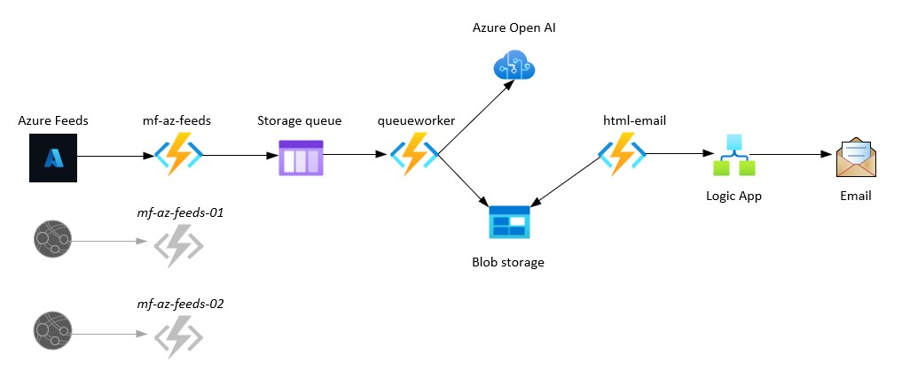

<p align="center">
  
</p>
<h1 align="center">
  AI Generated Azure News Summary
  <br>
</h1>

<h4 align="center">An Azure Function centred process that takes news articles from places like <a href="https://azurefeeds.com/" target="_blank">Azure Feeds</a> and creates a summary of them using <a href="https://azure.microsoft.com/en-us/products/ai-services/openai-service" target="_blank">Azure Open AI</a>.</h4>

<p align="center">
  <a href="#key-features">Key Features</a> •
  <a href="#diagram">Diagram</a> •
  <a href="#how-to-use">How To Use</a> •
  <a href="#credits">Credits</a> •
  <a href="#license">License</a> •
  <a href="#contact">Contact</a>
</p>

## Key Features

* Multiple Sources
  * This sample connects to one source (Azure Feeds), but this architecture could be scaled to connect to many sources.
* Summary Generated by Azure Open AI
  * Each news article is summarised by Azure Open AI.
* Email notification of summary
  * The summary is emailed to a list of recipients.
* Azure Functions
  * The process is run as an Azure Functions (Platform as a Service) so there is no admin overhead.

## Diagram



## Pre-req Azure components

This repo has the code for all three functions used in this process, but there are some pre-req components that need to be created in Azure before you can deploy the code.

:bulb: There is a current issue open to support multiple deployment options.

* Azure Function App
  * Add the below Function App Configuration Application settings once known.
    * "targetrss": "",
    * "logicappurl": "",
    * "containerurl": "",
    * "storageaccount": "", <---this is the connection string of your storage account.
    * "aoaiendpoint": "",
    * "aoaikey": "",
    * "aoaimodel": "",
    * "queuename": "rssprocess"
* Azure Storage Account
  * Blob Storage Container (remember the url path to this container. I.e. https://awesomename.blob.core.windows.net)
  * SAS Key (remember the key)
  * Queue with name rssprocess (this is hardcoded in the queueworker function.json)
* Azure Open AI resource (remember the endpoint name, key and model name.)
* Azure Logic App (remember the URL)

## How To Use

To clone and run this application, you'll need [Git](https://git-scm.com) installed on your computer.

```bash
# Clone this repository
$ git clone https://github.com/amitmerchant1990/ai-gen-news-summary

# Go into the repository
$ cd ai-gen-news-summary

# Deploy the pre-req Azure Components (More Options coming shortly) 

# Deploy the Function code to Azure, using Azure Functions Core Tools (More Options coming shortly) 
$ func azure functionapp publish <functionappname>
```

## Credits

This software uses the following open source packages:

- [Python](https://www.python.org/)
- [Azure Functions](https://azure.microsoft.com/en-au/products/functions/)
- [Azure Storage](https://learn.microsoft.com/en-us/azure/storage/common/storage-introduction)
- [Azure Open AI](https://azure.microsoft.com/en-us/products/ai-services/openai-service)
- [Azure Logic App](https://learn.microsoft.com/en-us/azure/logic-apps/logic-apps-overview)

## License

MIT License

Copyright (c) [2023] [Michael Friedrich]

Permission is hereby granted, free of charge, to any person obtaining a copy
of this software and associated documentation files (the "Software"), to deal
in the Software without restriction, including without limitation the rights
to use, copy, modify, merge, publish, distribute, sublicense, and/or sell
copies of the Software, and to permit persons to whom the Software is
furnished to do so, subject to the following conditions:

The above copyright notice and this permission notice shall be included in all
copies or substantial portions of the Software.

THE SOFTWARE IS PROVIDED "AS IS", WITHOUT WARRANTY OF ANY KIND, EXPRESS OR
IMPLIED, INCLUDING BUT NOT LIMITED TO THE WARRANTIES OF MERCHANTABILITY,
FITNESS FOR A PARTICULAR PURPOSE AND NONINFRINGEMENT. IN NO EVENT SHALL THE
AUTHORS OR COPYRIGHT HOLDERS BE LIABLE FOR ANY CLAIM, DAMAGES OR OTHER
LIABILITY, WHETHER IN AN ACTION OF CONTRACT, TORT OR OTHERWISE, ARISING FROM,
OUT OF OR IN CONNECTION WITH THE SOFTWARE OR THE USE OR OTHER DEALINGS IN THE
SOFTWARE.

---

## Contact

> LinkedIn [Michael Friedrich](https://www.linkedin.com/in/1michaelfriedrich/) &nbsp;&middot;&nbsp;
> GitHub [fredderf204](https://github.com/fredderf204) &nbsp;&middot;&nbsp;
> Twitter [@fredderf204](https://twitter.com/fredderf204)